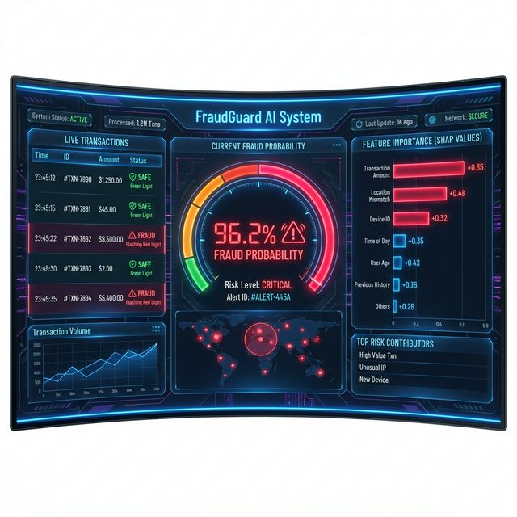
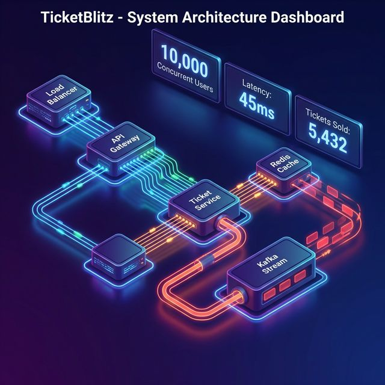
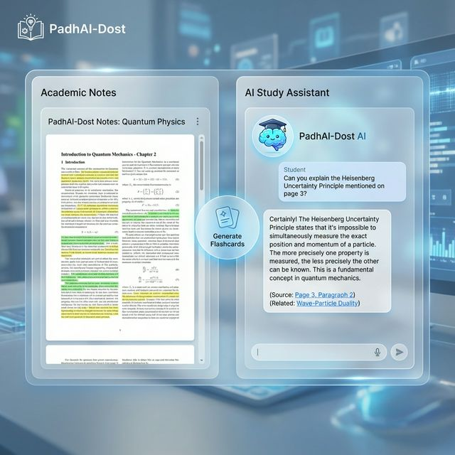

<div align="center">


[](https://git.io/typing-svg)

**MS Computer Science @ GWU** | Ex-Vodafone, HighRadius | 6+ Production Deployments

[](https://www.linkedin.com/in/abhi-bhardwaj-23b0961a0/)
[](https://ab0204.github.io/Portfolio/)
[](https://hashnode.com/@abhiibhardwaj01)
[](mailto:abhibhardwaj427@gmail.com)


</div>

---

## 📊 Quick Stats

<div align="center">

| 💼 Experience | 🚀 Projects Deployed | ⭐ Top Technologies | 🎓 Education |
|---------------|---------------------|---------------------|---------------|
| 2+ Years Professional | 7+ Production Apps | MLOps • Kafka • RAG | MS Computer Science @ GWU |

</div>

---

## Currently Building

### [Lumina AI - Visual Fashion Search Engine](https://github.com/AB0204/Lumina-AI)
> AI-powered visual commerce engine that understands fashion through computer vision. Upload any image to detect clothing items using **Owlv2** zero-shot detection, find similar products with **SigLIP** multimodal embeddings, and search through millions of items using **Qdrant** vector database—all with millisecond latency.

**Stack:** FastAPI • Next.js 15 • Owlv2 • SigLIP • Qdrant • Docker

---

## 🚀 Featured Projects

<table>
<tr>
<td width="50%">

### 🔐 [FraudGuard](https://github.com/AB0204/FraudGuard)
> **MLOps Fraud Detection** • $2.4M Annual Savings

⚡ **96.2% precision** • <50ms latency  
🛠️ `XGBoost` `MLflow` `FastAPI` `Docker` `CI/CD`

- Complete MLOps pipeline with drift detection
- Real-time model monitoring dashboard
- 40% reduction in false positives
- Automated retraining triggers

🔗 [**Live Demo**](https://risklens-pkut6xkwhua7dmugegejum.streamlit.app) • [**GitHub**](https://github.com/AB0204/FraudGuard)

</td>
<td width="50%">

### 🎟️ [TicketBlitz](https://github.com/AB0204/Ticket-Blitz)
> **High-Concurrency System** • 10K+ Concurrent Users

⚡ Zero race conditions • <120ms P95  
🛠️ `Kafka` `Redis` `WebSockets` `PostgreSQL` `Node.js`

- Real-time engineering visualizer
- Distributed locks & transactions
- Event-driven architecture
- Live WebSocket updates

🔗 [**Live Demo**](https://ticket-blitz.vercel.app/) • [**GitHub**](https://github.com/AB0204/Ticket-Blitz)

</td>
</tr>

<tr>
<td width="50%">

### 🎓 [PadhAI-Dost v2](https://github.com/AB0204/PadhAI-Dost)
> **RAG-Powered AI Assistant** • 500+ Users

⚡ Auto-flashcards • Contextual chat  
🛠️ `Next.js 14` `RAG` `ChromaDB` `Gemini 2.0` `LangChain`

- Retrieval-Augmented Generation pipeline
- Hybrid search with re-ranking
- Multi-cloud deployment
- Real-time learning analytics

🔗 [**Live Demo**](https://padhai-dost-v2.vercel.app) • [**GitHub**](https://github.com/AB0204/PadhAI-Dost)

</td>
<td width="50%">

### ☁️ [WeatherNow](https://github.com/AB0204/WeatherNow)
> **AI Weather Intelligence** • LSTM Neural Networks

⚡ 92% accuracy • <2s inference  
🛠️ `PyTorch` `FastAPI` `Streamlit` `Docker` `LSTM`

- LSTM for time series prediction
- 30-day historical analytics
- GPS geolocation with 100+ cities
- Interactive Plotly visualizations

🔗 [**Live Demo**](https://weathernow-rmuxbngwrdlmwmcgkmflmq.streamlit.app/) • [**GitHub**](https://github.com/AB0204/WeatherNow)

</td>
</tr>

<tr>
<td width="50%">

### 🛒 [UrbanKart](https://github.com/AB0204/UrbanKart)
> **Full-Stack E-Commerce** • 1000+ Concurrent Users

⚡ <100ms API response • <2s load time  
🛠️ `FastAPI` `React` `TypeScript` `MySQL` `Vite`

- JWT auth with RBAC
- MySQL triggers for automation
- Type-safe frontend
- Optimized indexing

🔗 [**Live Demo**](https://urbankart-store.surge.sh) • [**GitHub**](https://github.com/AB0204/UrbanKart)

</td>
<td width="50%">

### 📈 [SentiStock Analytics](https://github.com/AB0204/SentiStock-Analytics)
> **Stock Sentiment Analysis** • 10K+ Tickers

⚡ 100+ articles/min • 75-80% correlation  
🛠️ `Python` `NLP` `yfinance` `TextBlob` `Streamlit`

- Real-time sentiment analysis
- 10,000+ ticker support
- Interactive dashboard <2s fetch
- Price correlation analysis

🔗 [**Live Demo**](https://stock-agent-3pltsb8klfpsbzuukamwyd.streamlit.app/) • [**GitHub**](https://github.com/AB0204/SentiStock-Analytics)

</td>
</tr>
</table>

---

## 🎬 See Projects In Action

<details>
<summary><b>🔐 FraudGuard - MLOps Dashboard</b></summary>
<br>



**Key Features Shown:**
- Real-time fraud probability scoring
- SHAP explanation for model decisions
- Model drift detection alerts
- MLflow experiment tracking

🔗 [**Try Live Demo**](https://risklens-pkut6xkwhua7dmugegejum.streamlit.app)

</details>

<details>
<summary><b>🎟️ TicketBlitz - Real-Time Engineering Visualizer</b></summary>
<br>



**Key Features Shown:**
- Redis locks in action (acquire/release)
- PostgreSQL transaction flow
- Kafka event streaming
- WebSocket real-time updates

🔗 [**Try Live Demo**](https://ticket-blitz.vercel.app/)

</details>

<details>
<summary><b>🎓 PadhAI-Dost - RAG-Powered Study Assistant</b></summary>
<br>



**Key Features Shown:**
- PDF upload and processing
- Contextual AI chat with citations
- Auto-generated flashcards
- Learning analytics dashboard

🔗 [**Try Live Demo**](https://padhai-dost-v2.vercel.app)

</details>

---

## 💻 Skills Proficiency

<div align="center">

| Domain | Technologies | Level |
|--------|--------------|-------|
| **Machine Learning & MLOps** | PyTorch • XGBoost • LightGBM • MLflow • Evidently | ████████░░ 85% |
| **Data Engineering** | Kafka • Spark • Airflow • PostgreSQL • Redis | ████████░░ 80% |
| **GenAI & LLMs** | LangChain • RAG • ChromaDB • Gemini • OpenAI | ███████░░░ 75% |
| **Backend Development** | FastAPI • Node.js • Express • TypeScript | ████████░░ 85% |
| **Frontend** | React • Next.js 15 • TypeScript • Tailwind CSS | ███████░░░ 70% |
| **Cloud & DevOps** | Docker • Kubernetes • GCP • Vercel • CI/CD | ███████░░░ 70% |

</div>

---

## 🎯 Currently Building (2026)

```python
focus = {
    "creating": [
        "🚀 Real-time data streaming platform (Kafka + Spark)",
        "🤖 MLOps pipeline with automated retraining",
        "🧠 Multi-agent LLM application (LangGraph)"
    ],
    "learning": [
        "Advanced MLOps: A/B testing, model governance",
        "Distributed systems: Event-driven architecture",
        "Production LLM deployment & RAG optimization"
    ],
    "next": "Computer Vision with YOLO v8 for edge deployment"
}
```

---

## 💻 Tech Stack

<details open>
<summary><b>🤖 Machine Learning & AI</b></summary>
<br>


</details>

<details>
<summary><b>⚡ Data Engineering & Backend</b></summary>
<br>


</details>

<details>
<summary><b>🎨 Frontend</b></summary>
<br>


</details>

<details>
<summary><b>🗄️ Databases & Caching</b></summary>
<br>


</details>

<details>
<summary><b>☁️ Cloud & DevOps</b></summary>
<br>


</details>

---

## 📝 Latest Blog Posts

<table>
<tr>
<td width="70%">
<a href="https://zerotooneblog.hashnode.dev/building-production-ml-systems-mlops-best-practices">
<h3>🚀 Building Production ML Systems: MLOps Best Practices</h3>
</a>
<p>Deep dive into MLflow, model monitoring, and deployment strategies for production ML systems.</p>
<sub>📅 January 2026 • ⏱️ 8 min read</sub>
</td>
<td width="30%" align="right">

</td>
</tr>
</table>

<table>
<tr>
<td width="70%">
<a href="https://zerotooneblog.hashnode.dev/real-time-data-processing-kafka-spark">
<h3>⚡ Real-Time Data Processing with Kafka and Spark</h3>
</a>
<p>Building scalable streaming pipelines with Apache Kafka and Spark Structured Streaming.</p>
<sub>📅 December 2025 • ⏱️ 10 min read</sub>
</td>
<td width="30%" align="right">

</td>
</tr>
</table>

<table>
<tr>
<td width="70%">
<a href="https://zerotooneblog.hashnode.dev/deploying-llm-applications-rag-architecture">
<h3>🤖 Deploying LLM Applications: RAG Architecture Guide</h3>
</a>
<p>Complete guide to building and deploying Retrieval-Augmented Generation systems in production.</p>
<sub>📅 November 2025 • ⏱️ 12 min read</sub>
</td>
<td width="30%" align="right">

</td>
</tr>
</table>

➡️ [**Read more on my blog**](https://zerotooneblog.hashnode.dev)

---

<div align="center">

### 💼 Open to Full-Time Opportunities

**Machine Learning Engineer | Software Engineer | Data Engineer**

*Building production-grade AI systems with measurable business impact.*  
**Specializing in:** MLOps • Distributed Systems • Real-Time Data Engineering

[](https://www.linkedin.com/in/abhi-bhardwaj-23b0961a0/)
[](mailto:abhibhardwaj427@gmail.com)
[](https://ab0204.github.io/Portfolio/)

⭐️ *If you find my work interesting, consider starring my repositories!* ⭐️

</div>

---

<div align="center">

*Built with passion for scalable, production-ready systems* 🚀

</div>
