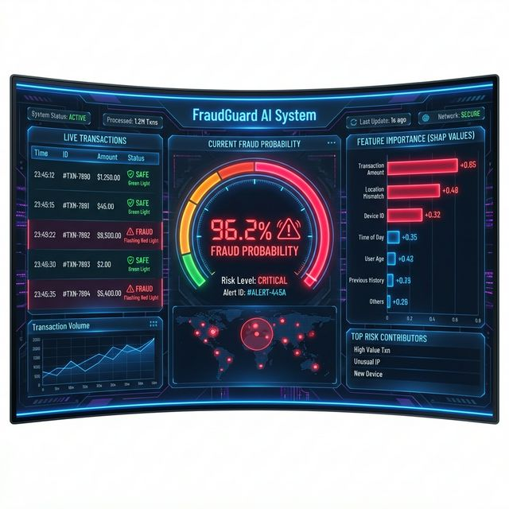
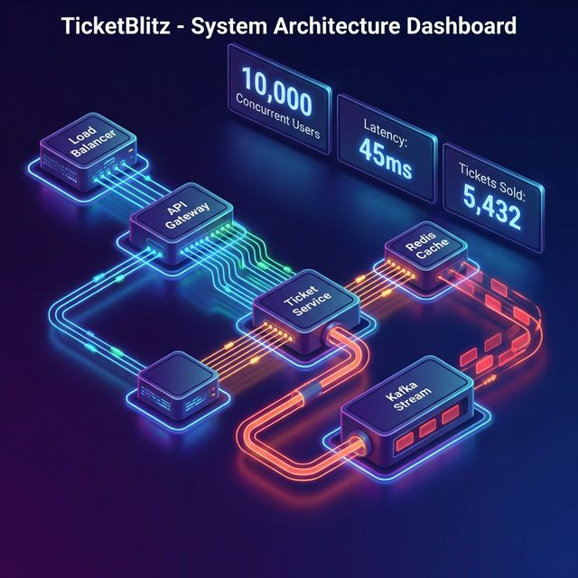
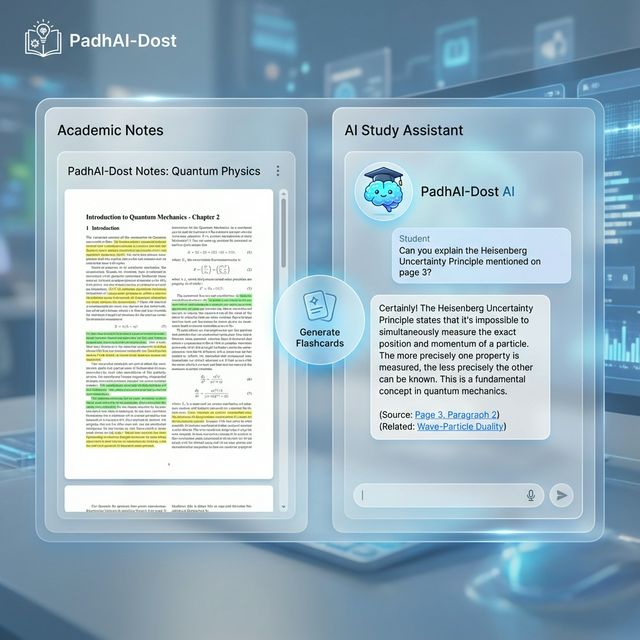

<div align="center">

[](https://git.io/typing-svg)

**MS Computer Science @ GWU** | Ex-Vodafone, HighRadius | 6+ Production Deployments

[](https://www.linkedin.com/in/abhi-bhardwaj-23b0961a0/)
[](https://abhics8.github.io/Portfolio/)
[](https://hashnode.com/@abhiibhardwaj01)
[](mailto:abhibhardwaj427@gmail.com)


</div>

---

## 📊 Quick Stats

<div align="center">

| 💼 Experience | 🚀 Projects Deployed | ⭐ Top Technologies | 🎓 Education |
|---------------|---------------------|---------------------|---------------|
| 2+ Years Professional | 8+ Production Apps | MLOps • Kafka • RAG • CV | MS Computer Science @ GWU |

</div>

---

## 🚀 Featured Projects

<table>
<tr>
<td width="50%">

### 🔮 [Lumina AI](https://github.com/Abhics8/Lumina-AI)
> **Visual Commerce Engine** • Live on HF Spaces

⚡ Semantic search • Two-stage retrieval  
🛠️ `OWLv2` `CLIP` `Qdrant` `FastAPI` `Next.js 15` `Redis` `Docker`

- Zero-shot object detection (OWLv2)
- Cross-encoder reranking pipeline
- Hybrid search: vector + structured filters
- CI/CD, Redis caching, full Docker stack

🔗 [**Live Demo**](https://huggingface.co/spaces/Ab0202000/lumina-ai-demo) • [**GitHub**](https://github.com/Abhics8/Lumina-AI)

</td>
<td width="50%">

### 🔐 [FraudGuard](https://github.com/Abhics8/FraudGuard)
> **MLOps Fraud Detection** • $2.4M Annual Savings

⚡ **96.2% precision** • <50ms latency  
🛠️ `XGBoost` `MLflow` `FastAPI` `Docker` `CI/CD`

- Complete MLOps pipeline with drift detection
- Real-time model monitoring dashboard
- 40% reduction in false positives
- Automated retraining triggers

🔗 [**Live Demo**](https://risklens-pkut6xkwhua7dmugegejum.streamlit.app) • [**GitHub**](https://github.com/Abhics8/FraudGuard)

</td>
</tr>
<tr>
<td width="50%">

### 🎫 [TicketBlitz](https://github.com/Abhics8/Ticket-Blitz)
> **High-Concurrency System** • 10K+ Concurrent Users

⚡ Zero race conditions • <120ms P95  
🛠️ `Kafka` `Redis` `WebSockets` `PostgreSQL` `Node.js`

- Real-time engineering visualizer
- Distributed locks & transactions
- Event-driven architecture
- Live WebSocket updates

🔗 [**Live Demo**](https://ticket-blitz.vercel.app/) • [**GitHub**](https://github.com/Abhics8/Ticket-Blitz)

</td>
<td width="50%">

### 🎓 [PadhAI-Dost v2](https://github.com/Abhics8/PadhAI-Dost)
> **RAG-Powered AI Assistant** • 500+ Users

⚡ Auto-flashcards • Contextual chat  
🛠️ `Next.js 14` `RAG` `ChromaDB` `Gemini 2.0` `LangChain`

- Retrieval-Augmented Generation pipeline
- Hybrid search with re-ranking
- Multi-cloud deployment
- Real-time learning analytics

🔗 [**Live Demo**](https://padhai-dost-v2.vercel.app) • [**GitHub**](https://github.com/Abhics8/PadhAI-Dost)

</td>
</tr>
<tr>
<td width="50%">

### ☁️ [WeatherNow](https://github.com/Abhics8/WeatherNow)
> **AI Weather Intelligence** • LSTM Neural Networks

⚡ 92% accuracy • <2s inference  
🛠️ `PyTorch` `FastAPI` `Streamlit` `Docker` `LSTM`

- LSTM for time series prediction
- 30-day historical analytics
- GPS geolocation with 100+ cities
- Interactive Plotly visualizations

🔗 [**Live Demo**](https://weathernow-rmuxbngwrdlmwmcgkmflmq.streamlit.app/) • [**GitHub**](https://github.com/Abhics8/WeatherNow)

</td>
<td width="50%">

### 📊 [SentiStock Analytics](https://github.com/Abhics8/SentiStock-Analytics)
> **Stock Sentiment Analysis** • 10K+ Tickers

⚡ 100+ articles/min • 75-80% correlation  
🛠️ `Python` `NLP` `yfinance` `TextBlob` `Streamlit`

- Real-time sentiment analysis
- 10,000+ ticker support
- Interactive dashboard <2s fetch
- Price correlation analysis

🔗 [**Live Demo**](https://stock-agent-3pltsb8klfpsbzuukamwyd.streamlit.app/) • [**GitHub**](https://github.com/Abhics8/SentiStock-Analytics)

</td>
</tr>
</table>

---

## 🎬 See Projects In Action

<details open>
<summary><b>🔮 Lumina AI - Visual Commerce Engine</b></summary>
<br>

**Key Features:**
- 🎯 Zero-shot fashion detection with OWLv2
- ✨ Style & vibe analysis using CLIP
- 🔍 Semantic product search with vector embeddings
- ⚡ Two-stage retrieval with cross-encoder reranking

🔗 [**Try Live Demo on Hugging Face**](https://huggingface.co/spaces/Ab0202000/lumina-ai-demo)

</details>

<details>
<summary><b>🔐 FraudGuard - MLOps Dashboard</b></summary>
<br>



**Key Features Shown:**
- Real-time fraud probability scoring
- SHAP explanation for model decisions
- Model drift detection alerts
- MLflow experiment tracking

🔗 [**Try Live Demo**](https://risklens-pkut6xkwhua7dmugegejum.streamlit.app)

</details>

<details>
<summary><b>🎫 TicketBlitz - Real-Time Engineering Visualizer</b></summary>
<br>



**Key Features Shown:**
- Redis locks in action (acquire/release)
- PostgreSQL transaction flow
- Kafka event streaming
- WebSocket real-time updates

🔗 [**Try Live Demo**](https://ticket-blitz.vercel.app/)

</details>

<details>
<summary><b>🎓 PadhAI-Dost - RAG-Powered Study Assistant</b></summary>
<br>



**Key Features Shown:**
- PDF upload and processing
- Contextual AI chat with citations
- Auto-generated flashcards
- Learning analytics dashboard

🔗 [**Try Live Demo**](https://padhai-dost-v2.vercel.app)

</details>

---

## 💻 Skills Proficiency

<div align="center">

| Domain | Technologies | Level |
|--------|--------------|-------|
| **Machine Learning & MLOps** | PyTorch • XGBoost • LightGBM • MLflow • Evidently | ████████░░ 85% |
| **Data Engineering** | Kafka • Spark • Airflow • PostgreSQL • Redis | ████████░░ 80% |
| **GenAI & LLMs** | LangChain • RAG • ChromaDB • Gemini • OpenAI | ███████░░░ 75% |
| **Backend Development** | FastAPI • Node.js • Express • TypeScript | ████████░░ 85% |
| **Frontend** | React • Next.js 15 • TypeScript • Tailwind CSS | ███████░░░ 70% |
| **Cloud & DevOps** | Docker • Kubernetes • GCP • Vercel • CI/CD | ███████░░░ 70% |

</div>

---

## 🎯 What I'm Exploring Next

```python
next_up = [
    "🧠 Multi-agent LLM application (LangGraph)",
    "🚀 Advanced computer vision: GroundingDINO, Florence-2",
    "📊 A/B testing infrastructure for ML models"
]
```

---

## 💻 Tech Stack

<details open>
<summary><b>🤖 Machine Learning & AI</b></summary>
<br>


</details>

<details>
<summary><b>⚡ Data Engineering & Backend</b></summary>
<br>


</details>

<details>
<summary><b>🎨 Frontend</b></summary>
<br>


</details>

<details>
<summary><b>🗄️ Databases & Caching</b></summary>
<br>


</details>

<details>
<summary><b>☁️ Cloud & DevOps</b></summary>
<br>


</details>

---

## 📝 Latest Blog Posts

<table>
<tr>
<td width="70%">
<a href="https://zerotooneblog.hashnode.dev/math-behind-the-magic-neural-networks-deep-learning-gwu">
<h3>🧠 The Math Behind the Magic: My Neural Networks & Deep Learning Journey at GWU</h3>
</a>
<p>A deep dive into neural networks, backpropagation, and my academic journey at George Washington University.</p>
<sub>📅 February 2026 • ⏱️ 13 min read</sub>
</td>
<td width="30%" align="right">

</td>
</tr>
</table>

<table>
<tr>
<td width="70%">
<a href="https://zerotooneblog.hashnode.dev/building-weathernow-can-ai-predict-tomorrows-weather-better-than-traditional-methods">
<h3>🌤️ Building WeatherNow: Can AI Predict Tomorrow's Weather Better Than Traditional Methods?</h3>
</a>
<p>How I built an AI weather intelligence platform using LSTM neural networks for time-series prediction.</p>
<sub>📅 January 2026 • ⏱️ 12 min read</sub>
</td>
<td width="30%" align="right">

</td>
</tr>
</table>

<table>
<tr>
<td width="70%">
<a href="https://zerotooneblog.hashnode.dev/rag-powered-learning-assistant-turning-static-pdfs-into-interactive-ai-tutors">
<h3>📚 RAG-Powered Learning Assistant: Turning Static PDFs Into Interactive AI Tutors</h3>
</a>
<p>Building a RAG-powered study assistant that transforms static PDFs into interactive learning experiences.</p>
<sub>📅 January 2026 • ⏱️ 11 min read</sub>
</td>
<td width="30%" align="right">

</td>
</tr>
</table>

<table>
<tr>
<td width="70%">
<a href="https://zerotooneblog.hashnode.dev/zero-to-one-handling-10000-concurrent-users-with-distributed-systems">
<h3>⚡ Zero to One: Handling 10,000 Concurrent Users with Distributed Systems</h3>
</a>
<p>Building scalable distributed systems with Kafka, Redis, and WebSockets for high-concurrency ticket booking.</p>
<sub>📅 January 2026 • ⏱️ 9 min read</sub>
</td>
<td width="30%" align="right">

</td>
</tr>
</table>

<table>
<tr>
<td width="70%">
<a href="https://zerotooneblog.hashnode.dev/zero-to-one-building-an-enterprise-grade-fraud-detection-system-from-scratch">
<h3>🔐 Zero to One: Building an Enterprise-Grade Fraud Detection System from Scratch</h3>
</a>
<p>How I architected a production-ready MLOps pipeline with 96% precision using XGBoost, MLflow, and FastAPI.</p>
<sub>📅 December 2025 • ⏱️ 3 min read</sub>
</td>
<td width="30%" align="right">

</td>
</tr>
</table>

➡️ [**Read more on my blog**](https://zerotooneblog.hashnode.dev)

---

<div align="center">

### 💼 Open to Full-Time Opportunities

**Machine Learning Engineer | Software Engineer | Data Engineer**

*Building production-grade AI systems with measurable business impact.*  
**Specializing in:** MLOps • Distributed Systems • Real-Time Data Engineering

[](https://www.linkedin.com/in/abhi-bhardwaj-23b0961a0/)
[](mailto:abhibhardwaj427@gmail.com)
[](https://abhics8.github.io/Portfolio/)

⭐️ *If you find my work interesting, consider starring my repositories!* ⭐️

</div>

---

<div align="center">

*Built with passion for scalable, production-ready systems* 🚀

</div>
